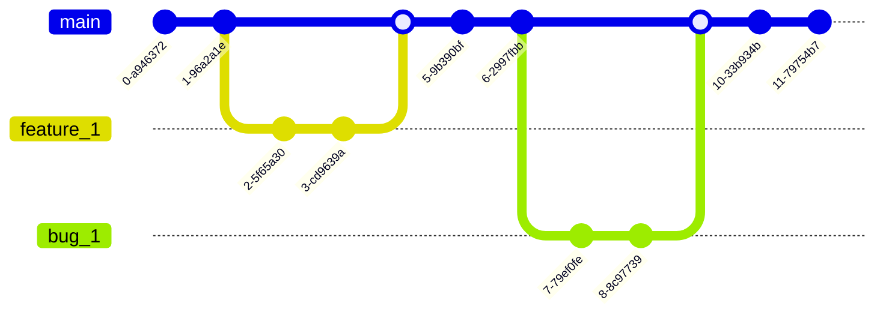

# Rendszerterv

## 1. A rendszer célja

## 2. Projektterv

### 2.1 Projektszerepkörök, felelősségek

Product owner: Tápai Árpád  
A prioritással és üzleti értékkel ellátott felhasználói sztorikat tartalmazó Product Backlog létrehozása és felügyelete.

Üzleti szereplők (Stakeholders):

- Megrendelő: Nincs.
- Célzott felhasználók: tanárok és diákok.

### 2.2 Projektmunkások és felelősségeik

Scrummaster:

- Zheng Yuan Qi

Frontend:

- Tápai Árpád
- Kis Sándor

Backend:

- Zheng Yuan Qi
  Feladatuk az adatbázis szerkezetek kialakítása, funkciók létrehozása, a frontend kiszolgálása adatokkal.

Tesztelés:

- Tápai Árpád
- Kis Sándor
- Zheng Yuan Qi

A szoftverekben meglévő hibák felderítése még az üzembe helyezés előtt.

### 2.3 Ütemterv

|     | Funkció / Story           | Feladat / Task                    | Prioritás | Becslés | Aktuális becslés |
| --- | ------------------------- | --------------------------------- | --------- | ------- | ---------------- |
|     | Követelmény specifikáció  |                                   | 0         | 12      | 12               |
|     | Funkcionális specifikáció |                                   | 0         | 12      | 12               |
|     | Rendszerterv              |                                   | 0         | 16      | 16               |
|     | Adattárolás               | Adatmodell megtervezése           | 0         | 4       | 4                |
|     | Adattárolás               | Adatbázis megvalósítása SQLiteban | 1         | 1       | 1                |
|     | Android applikáció        | Képernyőtervek elkészítése        | 2         | 8       | 8                |
|     | Android applikáció        | Prototípus elkészítése            | 2         | 8       | 8                |
|     | Android applikáció        | Adatbázis UIhoz kapcsolása        | 2         | 8       | 8                |
|     | Android applikáció        | Kezdőlap funkciók elkészítése     | 2         | 8       | 8                |
|     | Android applikáció        | Login funkció megvalósítás        | 2         | 8       | 8                |
|     | Android applikáció        | Registration funkció megvalósítás | 2         | 8       | 8                |
|     | Android applikáció        | Tesztelés                         | 2         | 16      | 16               |
|     | Adattárolás               | Tesztelés                         | 2         | 16      | 16               |
|     | Adattárolás               | Buffer bug javításra              | 2         | 16      | 16               |
|     | Android applikáció        | Buffer bug javításra              | 2         | 16      | 16               |
|     | Teljes applikáció         | Final Smoke Test                  | 2         | 4       | 4                |

### 2.4 Mérföldkövek

- A prototipus bemutatása
- Az elkészült szoftver átadása

## 3. Üzleti folyamatok modellje

### 3.1 Üzleti szereplők

A rendszert regisztrálás nélkül is lehet használni. Ekkor csak a meglévő tanárokat látja. Regisztráció után lehet új tanárt létrehozni.

### 3.2 Üzleti folyamatok

Bejelentkezés mindenki számára ugyanolyan lefutású:
A ’Login’ menüpontra kattintva megjelenik a ’Email’ és ’Password’ beviteli űrlap. A mezők kitöltése után a ’Belépés’ gombra kattint a felhasználó. Ha az azonosítás sikeres, akkor a felhasználó belépett és megjelenik a jogosultságának megfelelő menüsor.
Ha nem sikerül az azonosítás, hibaüzenet jelenik meg.

#### Üzleti folyamatok tanároknak:

- Tanár regisztrálása a rendszerben:
  Regisztráció után ha valaki belép akkkor látja a az adott tanárt is.

|     | Megnevezés                 |     |
| --- | -------------------------- | --- |
|     | Felhasználó név            |     |
|     | Jelszó                     |     |
|     | E-mail cím                 |     |
|     | Tanított tárgyak, és áraik |     |

- Lekérdezés (listák, kimutatások):
  A fő oldalon rögtön megjelennek az elérhető tanárok

### 3.3 Üzleti entitások

- Tanárgyak

## 4. Követelmények

### 4.1 Funkcionális követelmények

- Megjelenjenek a tanárok belépéskor
- Legyen lehetőség új tanár regisztrálására
- Már regisztrált tanár be tud lépni, és tudja módosítani az adatait

### 4.2 Nemfunkcionális követelmények

- Termék követelmények
  - Használhatósági követelmények: 
  A fejlesztésre kerülő szoftver a potenciális felhasználók számára könnyen tanulható és használható, minimális
  informatikai tudással alkalmazható.
  
  - Méret követelmények: 
  A szoftver mérete nem haladja meg az 1 Gigabyte-ot.
  
  - Hordozhatósági követelmények: 
  Az adatbázis cserélhető legyen

## 5. Funkcionális terv

### 5.1 Rendszerhasználati esetek és lefutásaik

#### 5.1.1 Bejelentkezés

#### 5.1.2 Regisztrálás

### 5.2
Képernyőtervek

Ez csak a Concept amit az elején csináltunk.  

## 6. Fizikai környezet

### 6.1 Vásárolt softwarekomponensek és külső rendszerek

Nincsenek vásárolt szoftverkomponensek.

### 6.2 Hardver és hálózati topológia

- Az alkalmazás egy android applikáció
- A jelenlegi implementáció SQLite adatbázist használ, de cserélhető komponens

### 6.3 Fizikai alrendszerek

- Mysql adatbázis szerver
- Android alapú rendszer
  - A beépített SQLite adatbázist használja

### 6.4 Fejlesztő eszközök

- Android Studio
- Visual Studio Code
- Github (git)

## 8. Architekturális terv

### 8.1 Architekturális tervezési minta

Az alkalmazás elkészítése során a felhasználói felület és az adatbázis szétválasztása eg fontos szempont volt. Egy Modulban lévő abstract és interface típusú osztályait használjuk az adatbázis függőségeinek csökkentésére.

### 8.2 Az alkalmazás rétegei, fő komponensei, ezek kapcsolatai

SQLite (Adatbázis) <-------> SQLiteHandler (Üzleti logika) <-------> Kliens (Felhasználói felület)

### 8.3 Változások kezelése

Minden változás lekezelése szerver oldalon történik, a kliens oldalon nincs szükség új komponensek telepítésére.

### 8.4 Git Branching stratégia

A fő branch a main. Minden új feature/bug esetén új branchet hozunk létre és ha kész van az adott dolog akkor mergeljük. Törekszünk a minél kisebb branchekre, és minél gyakoribb mergekre, a nagyobb git konfliktusokk elkerüléséért.

## 9. Adatbázisterv

### Tanárok (teachers)

| Adat         | Adat típus |
| ------------ | ---------- |
| ID           | INTEGER    |
| name         | TEXT       |
| image        | TEXT       |
| email        | TEXT       |
| phone_number | TEXT       |

- ID : Az adatbázis kulcsa
- name : a tanár neve
- image : a kép
- email : email cím
- phone_number: telefonszám

### Tantárgyak (subjects)

| Adat           | Adat típus |
| -------------- | ---------- |
| ID             | INTEGER    |
| teacher_id     | INTEGER    |
| name           | TEXT       |
| price_per_hour | INTEGER    |

- ID : Az adatbázis kulcsa
- teacher_id : tanár ID-ja
- name : tantárgy neve
- price_per_hour : órabér
